# ROBOCON 电控教学资料（新人文档版）

> 适用范围：ROBOCON 机器人电控入门、代码阅读、硬件连接和上手调试。
>
> 本文档是 GitHub 上的资料阅读入口，不绑定某一届比赛、某一台机器人或某个工程路径。具体芯片、器件、通信协议和比赛规则，以当届官方文件及队内实际设备为准。

## 文档导航

| 章节 | 直接跳转 |
| --- | --- |
| 电控组是什么 | [跳转到电控组职责](#1-电控组是什么) |
| 软硬件方向 | [跳转到软件与硬件方向](#2-电控的软硬件方向) |
| 系统组成 | [跳转到电控系统组成](#3-电控系统的基本组成) |
| 知识要求 | [跳转到需要掌握的知识](#5-需要掌握的知识) |
| UART/USART | [跳转到串口通信专题](#53-uartusart-串口通信专题) |
| 工具与开发流程 | [跳转到推荐工具链](#6-推荐工具链) / [跳转到标准开发流程](#7-一个功能的标准开发流程) |
| 学习方法 | [跳转到怎么学电控](#8-怎么学电控) |
| 团队要求 | [跳转到学习心态与团队要求](#9-新队员的学习心态与团队要求) |
| 课程顺序 | [跳转到推荐学习顺序](#10-推荐学习顺序) |
| 实践考核 | [跳转到实践任务与考核标准](#11-四阶段实践任务与考核标准) |
| 资料库 | [跳转到资料检索与 GitHub 资料库](#12-资料检索与-github-资料库) |

## 1. 电控组是什么

简单来说，电控组是机械组和算法组（上位机）之间的沟通桥梁，也是把比赛策略变成机器人动作的枢纽。

例如，机械组确定结构方案后，电控需要确认电机、传感器、限位和接口；算法组发出决策指令后，电控需要通过通信接收指令，控制执行机构完成指定动作组，并把必要的状态反馈回去。

电控的主要任务是调试机器人完成比赛要求。电控不是单独写代码，而是机械、硬件、通信和控制一起工作。

## 2. 电控的软硬件方向

电控通常包含软件和硬件两个方向。队内可以根据个人兴趣深耕，但新人首先要建立软硬件协同的完整认识：软件决定“怎么控”，硬件决定“能不能稳定地控住”。

### 软件方向

- 编写和调试机器人控制程序
- 设计代码实现底盘和机构的整体运动
- 完成电机通信、传感器采集和动作控制
- 实现闭环控制：传感器反馈 -> 控制器计算 -> 修正输出
- 设计 PID 等控制算法并进行参数调试
- 使用状态机组织多个动作，处理超时、掉线、越界和急停
- 将各模块集成到整机并持续验证

### 硬件方向

- 进行控制器、电调、电机、传感器和电源之间的接线
- 了解基本电路原理、模电和数电
- 阅读原理图，确认供电、地、信号方向和接口保护
- 使用嘉立创 EDA 或其他 EDA 工具绘制和检查电路板
- 配合 Keil、万用表、示波器等工具完成测试
- 快速定位供电、线束、接口和信号质量问题

## 3. 电控系统的基本组成

一个常见的机器人电控系统可以拆成三部分：

- **执行机构**：电机、舵机、气缸等，负责产生运动
- **控制器**：STM32 等 MCU，负责运行程序和计算控制量
- **通信与反馈**：CAN、UART、I2C、SPI、GPIO、编码器和其他传感器，负责传递指令与状态

分析任何一个功能时，都要能回答四个问题：输入是什么，控制器做了什么，输出是什么，反馈从哪里来。

## 4. 电控最重要的工作习惯

- 比赛中优先保证稳定、快速、准确和可维护，不追求没有验证过的复杂方案。
- 遇到问题先确认供电和接线，再检查引脚复用、外设配置、通信协议、参数和业务逻辑。
- 把大问题缩小成最小实验，确认单个模块正常后再接回整机。
- 记录现象、测量值、尝试过的方案和最终结论，避免重复踩坑。
- 与机械组和算法组约定清楚接口、方向、单位、频率、超时行为和异常状态。

常见故障很多并不是复杂算法导致的，而是线断了、协议错了、参数没有配对、引脚配置错误或状态机卡住了。

## 5. 需要掌握的知识

### 5.1 C 语言基础

这是电控软件的基础，重点掌握：

- 变量、常量、数据类型和运算符
- 条件、循环和其他基础语句
- 函数、数组、指针和结构体
- 枚举、宏、关键字和程序结构
- 位运算、位域和寄存器配置中常见的掩码写法
- 头文件、模块接口、作用域和基本的内存概念
- `volatile` 在中断和外设状态变量中的作用

学习目标不是背语法，而是能读懂一个外设驱动，修改参数，并写出结构清楚、可调试的模块。

### 5.2 单片机与 STM32

需要逐步掌握 MCU、时钟、复位、启动文件、Flash、RAM、中断和调试器的基本概念，以及以下常用外设：

- GPIO 与外部中断
- UART/USART 串口
- DMA
- ADC
- NVIC 与中断优先级
- I2C 和 SPI
- 定时器与 PWM
- CAN
- 时钟树
- 看门狗和基本的异常保护

每学习一个外设，都要完成“初始化、发送或采集、验证、异常处理”四步，而不是只看完教程。

### 5.3 UART/USART 串口通信专题

> 本节知识点整理自 [《STM32 内置的通讯协议》](https://blog.csdn.net/cykaw2590/article/details/144249326)，原文作者：cykaw2590，原文采用 CC BY-SA 4.0 协议。
>
> 文中技术图片保留原图水印并放在本地 `assets/uart/` 目录，仅作为本队教学资料使用。再分发或修改图片时，请遵守原文的 CC BY-SA 4.0 要求。

#### 学习目标

- 能说清 UART、USART、TX、RX、波特率和数据帧的含义。
- 能完成 STM32 串口的 GPIO、时钟、参数、中断和 HAL 初始化。
- 能区分查询发送、中断收发和 DMA 收发的使用场景。
- 能根据现象排查“发不出、收不到、乱码、偶发丢帧”等问题。

#### 1. 串口通信是什么

串口通信是按照约定顺序，一位一位传输数据的通信方式。UART 通常指异步串行收发器，USART 在 UART 的基础上还可以支持同步通信；ROBOCON 电控中最常见的是 USART 外设配置为异步模式。

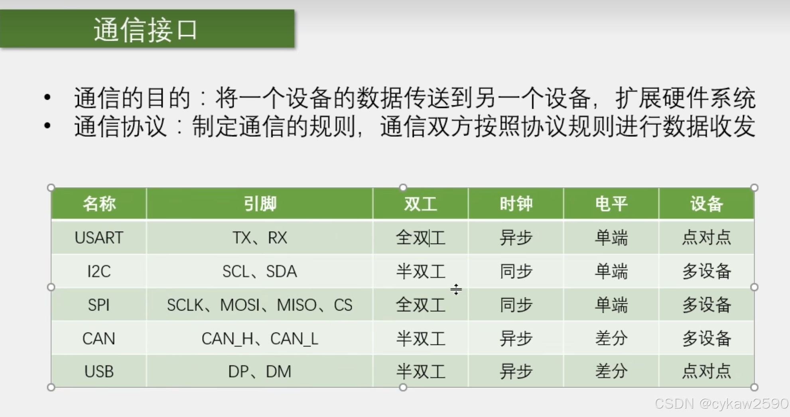

串口异步通信至少需要约定：

- 波特率
- 数据位数
- 校验方式
- 停止位数
- 电平标准和接线方式

UART 常用 TX、RX 两根信号线，实际连接时通常还要共地：发送端 TX 接接收端 RX，发送端 RX 接接收端 TX。RTS/CTS 属于可选的硬件流控信号，是否使用要看设备协议和硬件连接。

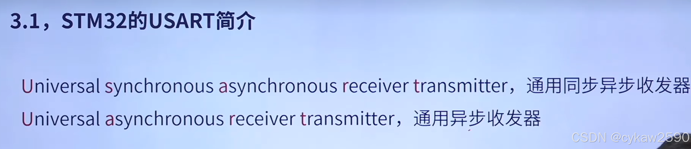

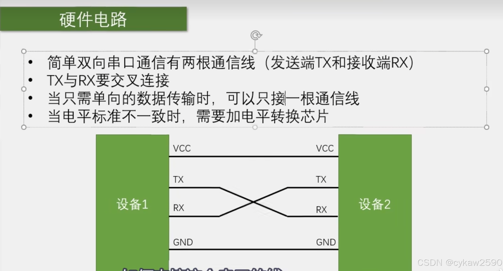

#### 2. 电平与物理连接

STM32 的 UART 引脚通常是 TTL/CMOS 电平，不能因为都叫“串口”就直接和 RS-232 或 RS-485 总线相连。RS-232、RS-485 需要对应的收发器完成电平转换；USB 转串口模块也要确认其输出电平与 MCU 供电电压匹配。

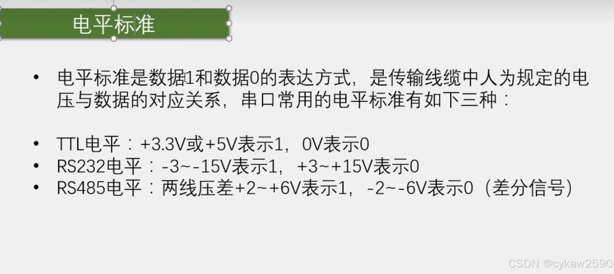

接线前检查：

1. 两端是否共地。
2. TX 和 RX 是否交叉连接。
3. 两端电平是否兼容。
4. 供电电压、接口方向和线束是否正确。
5. 长线、强干扰环境是否需要屏蔽、终端或差分收发器。

#### 3. 数据帧和时序

串口不是把一个整数直接“丢到线上”，而是按照数据帧传输。典型异步串口帧如下：

- 空闲线通常为高电平。
- 起始位通常为低电平，用来标记一帧开始。
- 数据位是有效载荷，常见配置为 8 位，通常低位先发送。
- 校验位可选，用于发现部分传输错误。
- 停止位为高电平，用于标记一帧结束和帧间隔。

常见的 `8N1` 表示 8 位数据、无校验、1 位停止。每帧通常为 1 个起始位 + 8 个数据位 + 1 个停止位，共 10 个位时间；在不考虑额外间隔时，115200 波特率下理论字符速率约为 11520 字符/秒。

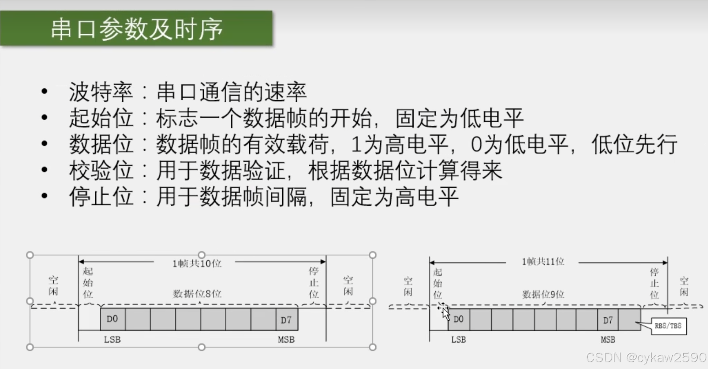

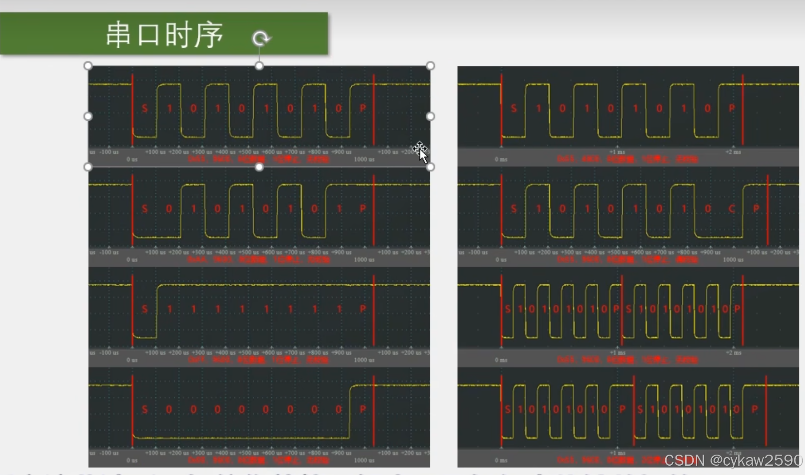

接收端根据约定的波特率在每个数据位的中间附近采样。STM32 某些系列支持 16 倍过采样，并通过多次采样提高抗干扰能力；具体采样方式和错误标志位以目标芯片参考手册为准。

#### 4. USART 外设的信号路径

USART 外设负责把 GPIO 上的电平变化转换成数据，也负责把待发送数据转换成 TX 引脚上的时序。软件主要通过数据寄存器、状态寄存器和控制寄存器与外设交互。

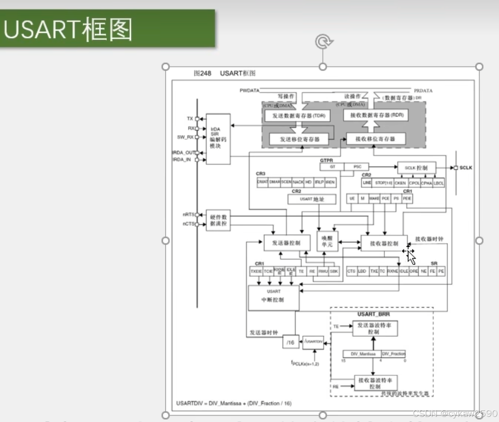

一个 USART 引脚还可能复用为定时器、SPI、I2C 或其他功能。同一时间一个引脚只能工作在一种复用功能下，所以配置串口时必须同时确认 GPIO 时钟、GPIO 模式、复用映射和 USART 实例。

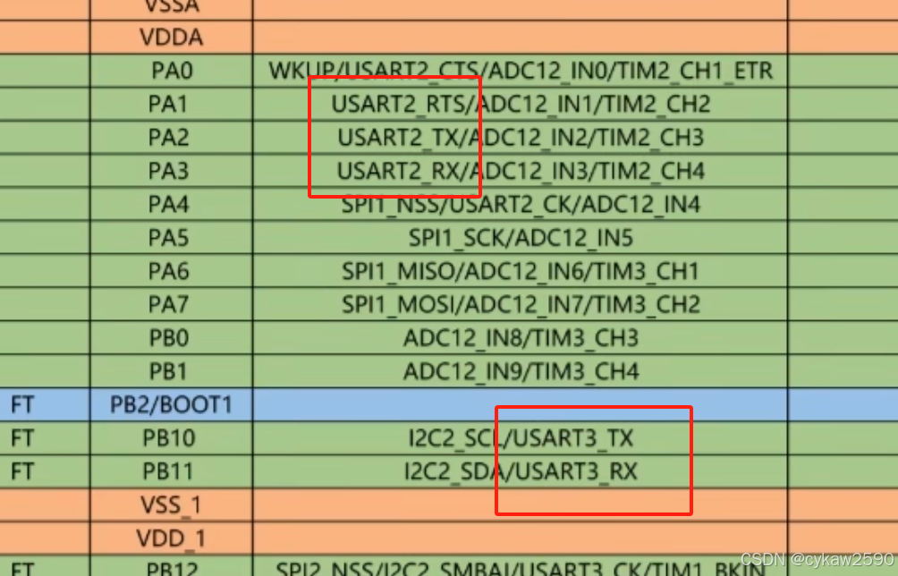

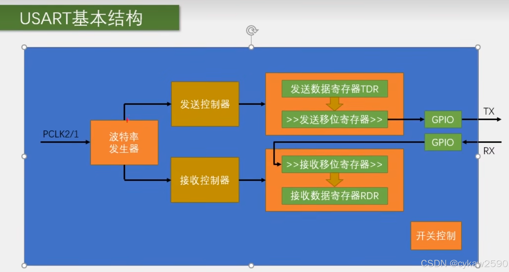

#### 5. 波特率计算

以支持 16 倍过采样的 STM32F1 USART 为例：

```text
USARTDIV = f_CK / (16 × baud)
baud     = f_CK / (16 × USARTDIV)
```

其中 `f_CK` 是 USART 使用的外设时钟，`baud` 是目标波特率。USARTDIV 的整数部分和小数部分需要按照芯片手册的格式写入 `USART_BRR`；小数部分通常按 16 倍进行量化和四舍五入。

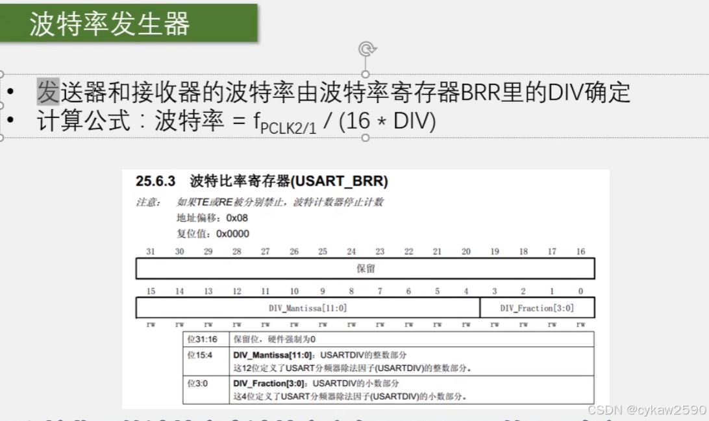

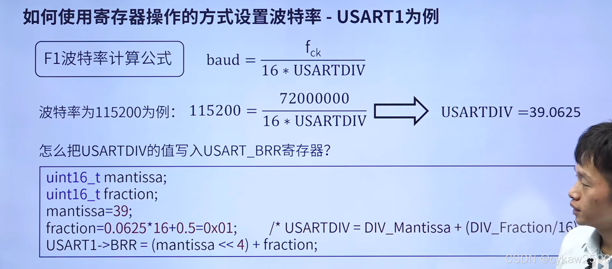

注意：不同 STM32 系列的外设时钟来源、过采样倍率、寄存器命名和波特率公式可能不同。不要直接套用别的芯片的 BRR 数值，应先确认时钟树和参考手册。

#### 6. 重要寄存器和状态位

不同系列的寄存器名称可能略有差别，以下以文章所讲的 STM32F1 风格 USART 为例：

- `CR1`：配置收发使能、字长、校验、中断等。
- `CR2`：配置停止位和同步相关功能。
- `CR3`：配置硬件流控、DMA 等扩展功能。
- `DR`：软件读写的数据寄存器；部分系列会拆分为 `RDR` 和 `TDR`。
- `SR`：状态寄存器，反映发送、接收和错误状态。

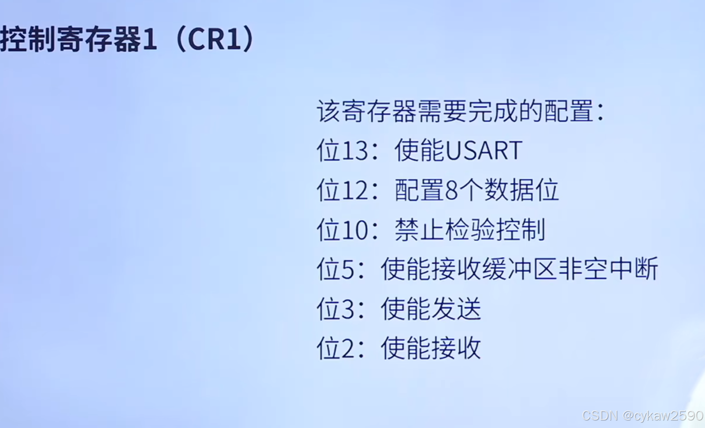

最常见的状态位：

| 标志位 | 含义 | 电控中的使用 |
| --- | --- | --- |
| `TXE` | 发送数据寄存器为空 | 可以写入下一个待发送字节 |
| `TC` | 数据寄存器和移位寄存器都为空 | 当前帧已经全部发到线上 |
| `RXNE` | 接收数据寄存器非空 | 有数据可读取 |
| `ORE` | 接收溢出 | 上一字节没有及时处理，可能丢数据 |
| `NE/FE/PE` | 噪声、帧、校验错误 | 帮助判断线路或参数异常 |

`TXE=1` 不等于最后一个字节已经发完；需要确认整帧发送结束时，应关注 `TC`。错误标志的清除顺序和寄存器读写要求与芯片系列有关，使用 HAL 时优先按照 HAL 文档和参考手册处理。

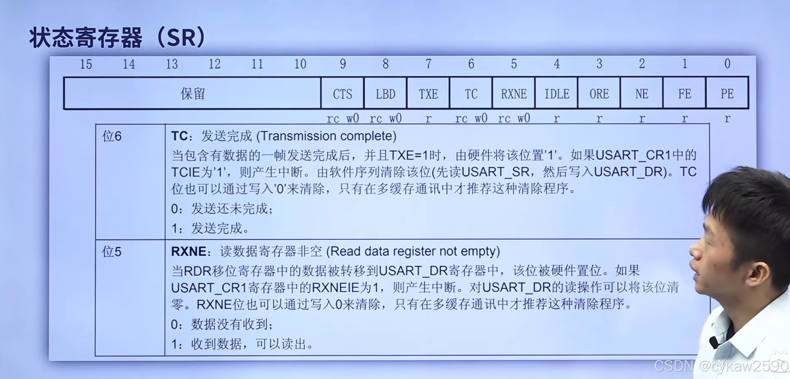

#### 7. HAL 库初始化

使用 HAL 库时，串口配置通常包含以下步骤：

1. 使能 USART 外设时钟和对应 GPIO 端口时钟。
2. 将 TX/RX 配置为正确的复用功能和电气模式。
3. 配置波特率、数据位、停止位、校验、收发模式和过采样。
4. 配置 NVIC（如果使用中断）以及 DMA（如果使用 DMA）。
5. 调用 `HAL_UART_Init()` 完成初始化。

GPIO 时钟不能省略：USART 只负责数据收发，TX/RX 引脚属于 GPIO 端口，复用功能和 GPIO 配置需要 GPIO 时钟支持。

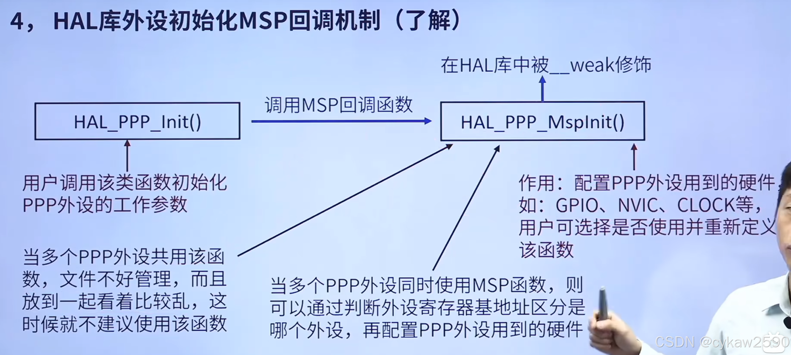

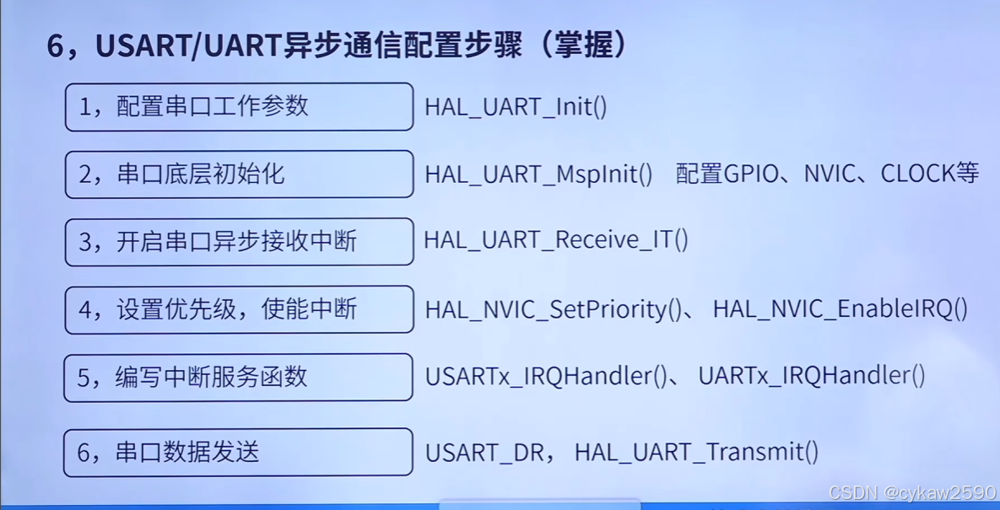

`HAL_UART_Init()` 会调用 `HAL_UART_MspInit()`。工程中应在 MSP 初始化函数中完成底层 GPIO、时钟、NVIC 和 DMA 配置，并注意代码生成工具重新生成工程时不要覆盖手写内容。

#### 8. HAL 句柄和初始化参数

`UART_HandleTypeDef` 是 HAL 对一个 UART/USART 实例的管理结构体，常见成员包括外设实例、初始化参数、DMA 句柄、状态和错误码。

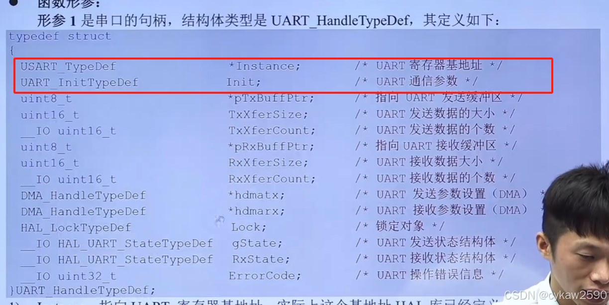

初始化参数至少要检查：

- `BaudRate`：波特率
- `WordLength`：数据位配置
- `StopBits`：停止位
- `Parity`：校验方式
- `Mode`：发送、接收或收发
- `HwFlowCtl`：硬件流控
- `OverSampling`：过采样配置（目标系列支持时）

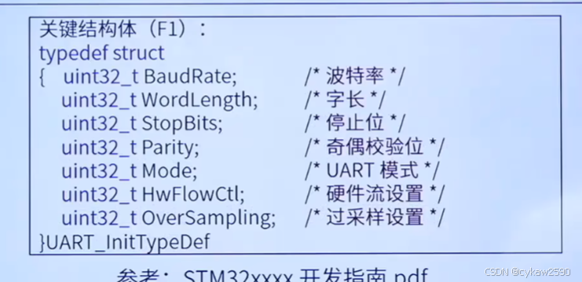

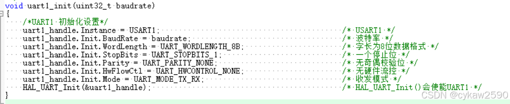

#### 9. 发送和接收方式

HAL 常见接口可以按是否阻塞、是否使用中断或 DMA 来区分：

| 方式 | 典型函数 | 特点 | 适合场景 |
| --- | --- | --- | --- |
| 查询/阻塞 | `HAL_UART_Transmit`、`HAL_UART_Receive` | 函数等待完成，占用当前执行流程 | 初始化测试、短数据、低频调试 |
| 中断 | `HAL_UART_Transmit_IT`、`HAL_UART_Receive_IT` | 由中断推进收发，通过回调通知完成 | 控制指令、短帧、需要及时响应的通信 |
| DMA | `HAL_UART_Transmit_DMA`、`HAL_UART_Receive_DMA` | DMA 搬运数据，CPU 负担低 | 连续数据、高频数据或较长缓冲区 |

中断接收通常要完成“启动一次接收 -> 进入 IRQ Handler -> HAL 处理 -> 回调函数 -> 再次启动接收”的闭环。如果回调中没有重新调用接收函数，下一帧可能不会再进入回调。

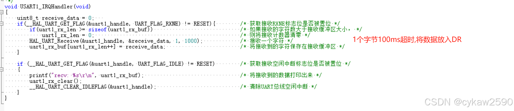

一个最小的单字节中断接收示例：

```c
static uint8_t uart1_rx_byte;

void uart1_start_receive(void)
{
    HAL_UART_Receive_IT(&huart1, &uart1_rx_byte, 1);
}

void HAL_UART_RxCpltCallback(UART_HandleTypeDef *huart)
{
    if (huart == &huart1)
    {
        // 在这里放入环形缓冲区或协议解析器
        HAL_UART_Receive_IT(&huart1, &uart1_rx_byte, 1);
    }
}
```

实际工程还需要加入帧头、长度、数据区、校验和超时处理，不能把“收到一个字节”直接等同于“收到一条完整指令”。

#### 10. 引脚复用和重映射

串口初始化失败时，除了检查 USART 外设本身，还要检查引脚映射。同一个 GPIO 只能在同一时刻选择一种功能；某些 STM32F1 外设使用重映射选择引脚，较新的系列常使用 GPIO 复用功能编号（AF）。

查找引脚时应以目标芯片的数据手册为准，确认：

- USART 实例对应的 TX/RX 引脚
- 默认复用功能或重映射选项
- GPIO 端口时钟和 USART 外设时钟
- 引脚的电气类型、上下拉和速度
- 是否与 SWD、定时器、SPI 或其他外设冲突

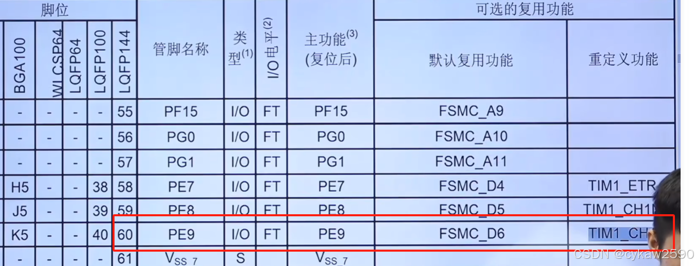

#### 11. 串口故障排查

| 现象 | 优先检查 |
| --- | --- |
| 完全没有输出 | USART/GPIO 时钟、TX 引脚复用、发送函数返回值、供电和共地 |
| 对端收不到 | TX/RX 是否交叉、波特率和帧格式、接口电平是否匹配 |
| 收到乱码 | 两端波特率、数据位、校验、停止位、时钟配置和信号质量 |
| 中断不进入 | NVIC、IRQ Handler、`HAL_UART_IRQHandler`、是否启动接收 |
| 只收到一次 | 回调中是否重新启动 `HAL_UART_Receive_IT` 或 DMA 接收 |
| 偶发丢字节 | 接收处理不及时、缓冲区太小、溢出标志、阻塞代码和通信频率 |
| 长线通信不稳定 | 电平转换、共地、屏蔽、线束走向、收发器和终端匹配 |

### 5.4 控制与电机

- 理解电机、电调、编码器和控制器之间的信号流
- 区分开环控制和闭环控制
- 理解目标值、反馈值、误差、输出限幅和控制周期
- 掌握 PID 控制的基本原理、代码实现和调参方法
- 根据机械结构、负载、减速比和传感器反馈分析控制效果
- 先让单个执行机构稳定工作，再组合成底盘或机构动作

### 5.5 调试与查阅手册

- 使用 Keil 在线调试，设置断点、单步执行、查看变量和寄存器值
- 能根据数据手册查引脚定义、电气参数和封装信息
- 能根据参考手册查外设寄存器、工作模式、时序和中断标志
- 能使用串口打印、逻辑分析仪或示波器观察信号
- 记录复现条件，避免只凭“感觉”修改代码

### 5.6 硬件与接线

- 识别电源、地、信号线、通信线和屏蔽或保护连接
- 了解基本电路原理、模电和数电的常见概念
- 检查电压范围、极性、共地、接口方向和线束固定
- 使用嘉立创 EDA、AD 或其他 EDA 工具绘制和检查电路板
- 理解封装、网络、去耦、接口保护和 DRC 等基本要求
- 用万用表、示波器快速判断短路、断路、电压异常和信号质量问题

## 6. 推荐工具链

- **Keil MDK**：STM32 工程的编译、下载和在线调试
- **STM32CubeMX**：配置芯片、时钟、引脚和外设，并生成初始化代码
- **ST-Link/J-Link**：连接调试器和目标板
- **串口工具**：查看日志、发送测试指令和验证通信
- **万用表、示波器、逻辑分析仪**：验证供电和信号
- **嘉立创 EDA、AD 或 KiCad**：绘制、检查和维护硬件资料
- **GitHub**：保存版本、维护文档、记录问题和协作交接
- **VS Code**：可用于阅读、搜索和辅助编辑代码，但应遵守队内工程的编译与调试方式

## 7. 一个功能的标准开发流程

1. 明确机器人要完成的动作，以及动作的输入、输出和反馈。
2. 与机械组和算法组确认接口、方向、单位、范围、控制周期和异常行为。
3. 查看芯片、传感器、电调和通信协议的手册，确认引脚、供电和数据格式。
4. 检查电源和接线，再用 CubeMX 或工程配置完成外设初始化。
5. 先编译，再下载一个最小测试程序，确认调试器、时钟和基础外设正常。
6. 使用 Keil 断点、变量窗口、寄存器窗口和串口日志定位问题。
7. 先单独验证通信、传感器和执行机构，再合并成完整动作。
8. 在真实负载下测试限幅、急停、通信超时、掉线恢复和上电默认状态。
9. 记录接线、参数、测试结果和已知问题，再提交代码和文档。

## 8. 怎么学电控

### 8.1 先学应用，再学原理

新人不需要一开始就把所有底层细节一次性学完。先让 LED 闪烁、串口收发、PWM 输出和一个电机功能跑起来，再回头理解时钟树、寄存器、通信时序和 PID。

“先跑起来”不等于永远不理解原理。每完成一个功能，都要补上它的输入输出、关键配置、限制条件和故障排查方法。

### 8.2 比赛导向

学习内容要服务机器人任务。ROBOCON、RoboMaster 和其他赛事的资料可以作为参考，但器件、接口和控制目标可能不同，不能未经验证直接照搬。

## 9. 新队员的学习心态与团队要求

这些要求来自学长的实践经验，目的是帮助新人判断自己是否适合长期投入比赛：

- **保持好奇心**：点亮一个灯、完成一次通信或解决一个故障，都是建立正反馈的机会。遇到难度上升和挫败感时，先把问题拆小，不要直接逃避。
- **培养自学能力**：队友和学长可以辅助排坑，但大多数知识需要自己查资料、做实验和复盘。提问前先说明已经看过什么、现象是什么、尝试过什么。
- **具备耐心和责任心**：调试 BUG 可能需要长时间重复测量和验证。任务要按时完成；遇到无法完成的情况，应提前说明原因和预计进度。
- **合理安排时间**：比赛需要持续投入，不能只在临近考核或比赛时突击。先完成分配的任务，再安排娱乐和休息，保证长期学习效率。
- **保持学徒心态**：尊重分工和队内安排，认真完成基础训练；不懂就问，验证后反馈，也要逐渐形成独立判断能力。

## 10. 推荐学习顺序

下面的顺序来自附件中的队内学习经验。短视频链接可能随平台调整，失效时可按课程名称和作者搜索；课程是学习入口，不是唯一答案。

### 第一阶段：用 51 单片机建立直觉（体验为主）

课程链接：<https://b23.tv/3kQj3cU>

跟随江协科技的教程完成简单实验，把它当作认识单片机的体验阶段。重点是记录代码中出现的知识名称，例如 GPIO、定时器、串口、中断和 PWM，不要求此时彻底吃透所有代码。

### 第二阶段：系统学习 C 语言（必须认真掌握）

课程链接：<https://b23.tv/vhM1KLn>

这是后续看懂 STM32 工程和比赛代码的基础。重点学习变量、运算符、基础语句、函数、数组、指针、结构体、关键字和程序结构，并回头补齐第一阶段遇到的知识点。

### 第三阶段：学习 STM32 和常用外设

1. **环境配置**：<https://b23.tv/vdHOlxH>

   了解 STM32 的开发环境和以后正式工作的基本工具，与 51 单片机的工程方式区分开。

2. **HAL 库入门**：<https://b23.tv/EZNscCd>

   这是 keysking 的 HAL 库教程，适合先建立外设使用的整体印象。

3. **HAL 库巩固**：<https://b23.tv/MBRszvb>

   这是铁头山羊的 HAL 库教程，适合更详细地练习。学完 UART 等一个模块后，连续几天用它做小实验，同时复习前面的内容，不要只看一遍视频就结束。

4. **标准库了解**：<https://b23.tv/ZjHSJWp>

   江协科技的标准库教程可用于理解另一种 STM32 编程方式，帮助新人读懂不同历史工程。当前项目使用 HAL 还是标准库，以队内工程为准。

### 第四阶段：拓展与比赛实战

- **FreeRTOS**：学有余力时再学习任务调度、队列、信号量和互斥锁。先掌握裸机外设和中断，避免还没理解基础就被操作系统概念分散注意力。
- **电机和比赛设备**：基础内容通过考核后，再接触队伍实际使用的电机、电调、传感器和其他设备。
- **实战课程**：<https://b23.tv/v2OXlzL>

  附件推荐的中科大电控教程偏实战，难度更高，适合作为进入比赛设备和整机控制前后的拓展材料。

## 11. 四阶段实践任务与考核标准

| 阶段 | 学习目标 | 必做成果 |
| --- | --- | --- |
| 第一阶段 | 能编译、下载、调试并使用 Git | LED 工程、串口打印、Keil 断点调试记录 |
| 第二阶段 | 能独立使用常用外设 | GPIO、定时器/PWM、UART、ADC 或 SPI 实验记录 |
| 第三阶段 | 能控制一个真实执行机构 | 电机或舵机控制程序、通信帧说明、限幅和急停逻辑 |
| 第四阶段 | 能接入机器人系统 | 一个完整动作状态机、联调记录、故障复现与恢复方案 |

达到“会用”的标准：

- 能画出一个功能的“输入 -> 控制器 -> 输出 -> 反馈”数据流，并说明关键线路的作用。
- 能根据手册找到引脚、供电范围、通信格式、时序和初始化要求，而不是只复制代码。
- 能按“供电 -> 接线 -> 引脚复用 -> 时钟/外设配置 -> 协议 -> 业务逻辑”的顺序排查故障，并保留测量证据。
- 能把一个大问题缩小成可复现的最小实验，确认后再合并回主工程。
- 能向队友交接代码、参数、接线和已知问题，使别人可以复现结果。

## 12. 资料检索与 GitHub 资料库

### 12.1 资料检索顺序

推荐按照以下顺序查资料：

1. 芯片数据手册和参考手册
2. 传感器、电调和其他设备的官方手册
3. 官方示例、HAL/标准库 API 文档
4. 高质量课程和教程
5. 论坛问答和搜索结果

教程适合入门，最终结论要回到手册、代码和实测。搜索时带上具体对象和现象，例如“STM32 定时器 PWM 频率计算”“CAN 接收中断不进入”“电调反馈帧解析”，不要只搜索“电机怎么控制”。
